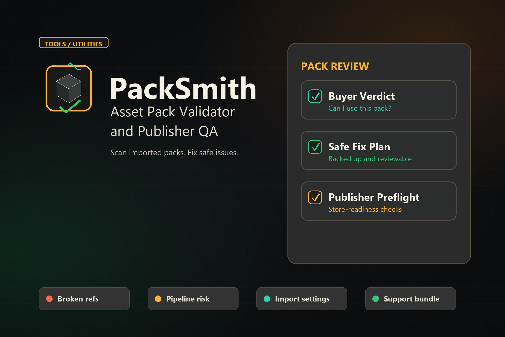
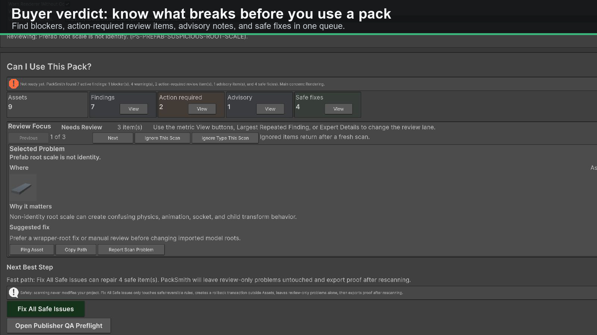
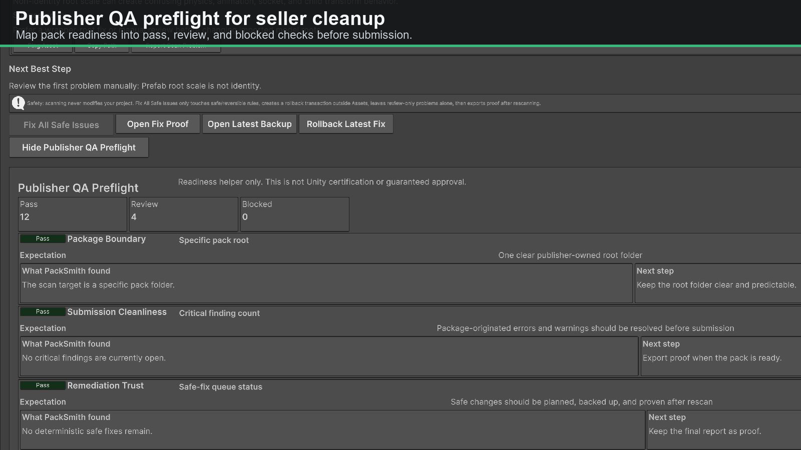
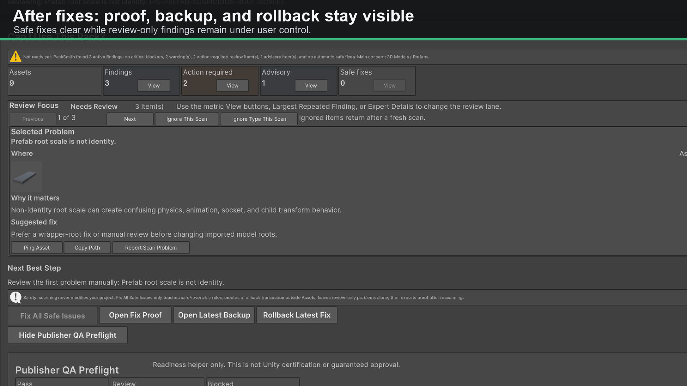
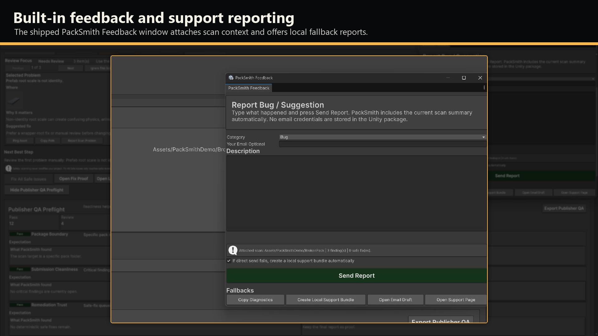

# PackSmith

PackSmith is a Unity Editor tool for asset-pack intake, QA, safe fixes, publisher preflight, and reproducible reports.



This repository is the public support, release-note, and update-manifest channel for PackSmith.

The paid Unity package is distributed through the Unity Asset Store. This repository intentionally does not publish the paid package source or internal development materials.

## Source and License Boundary

This repository contains support documentation, issue templates, release notes,
and update metadata for PackSmith. The paid Unity package, package source,
implementation details, internal QA fixtures, and commercial roadmap are
proprietary and intentionally not published here.

No license is granted to redistribute, reverse engineer, or republish the paid
Unity package. Public files in this repository may be linked for PackSmith
support, release tracking, and update checks.

## Support

- Website: https://xyflowinnovations.com/packsmith
- Email: founder@xyflowinnovations.com
- Bug reports: use the in-app `Report Bug / Suggestion` button or the GitHub issue template.
- Suggestions: use the in-app feedback window or the GitHub suggestion template.
- Private project details should not be posted publicly; use email or the in-app local support bundle flow.

## Updates

PackSmith checks:

```text
https://xyflowinnovations.com/packsmith/update-manifest.json
```

The latest release notes are available from GitHub Releases and the PackSmith website.

## Current Version

```text
0.1.0
```

## Package Promise

- Read-only scan by default.
- Findings are grouped by impact so large scans can be reviewed by type.
- Safe fixes require explicit confirmation.
- Safe fixes create a rollback transaction outside `Assets`.
- Fix proof reports are exported after changes.
- Review-only findings are never modified automatically.
- No destructive unused-asset deletion in v1.

## What PackSmith Checks

- Broken references, missing meshes, missing materials, and missing scripts.
- Render-pipeline and shader/material risks.
- Prefab, collider, animation, texture, sprite, audio, scene, and package hygiene issues.
- Long paths, unsafe names, suspicious files, empty folders, archives, and package debris.
- Seller readiness: documentation, dependencies, compatibility notes, demo/sample signals, third-party notice risk, and publisher preflight issues.

## Screenshots

| Buyer verdict | Publisher preflight |
| --- | --- |
|  |  |

| Fix proof and rollback | Feedback reporting |
| --- | --- |
|  |  |

## Distribution

PackSmith is a commercial Unity Editor extension. This repository exists so users can find support, issue templates, update metadata, and release notes without exposing the paid implementation.
